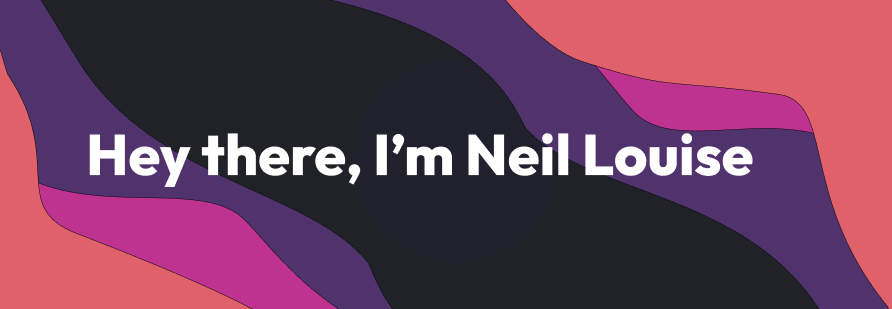

[]
                  

# 👨‍💻 About me
- 👨‍💻 3rd-Year Computer Engineering Student 
- 💡 Passionate about Pushing the Boundaries of Software & Hardware 
- 📩 Connect with me at neill03.castillon@gmail.com

